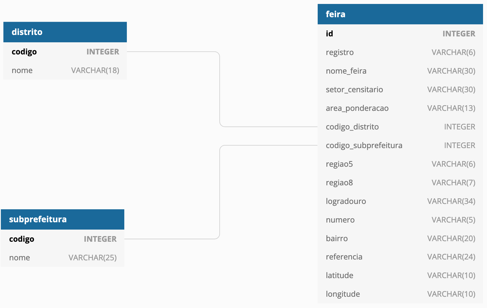

# API Feiras Livres

API desenvolvida em Python para expor os dados abertos das feiras livres da cidade de São Paulo.

A API foi construída tomando como base os dados do ano de 2014, contidos no arquivo `DEINFO_AB_FEIRASLIVRES_2014.csv`, e explanados em `DEINFO_AB_FEIRASLIVRES_2014_Variаveis.csv`.

O material pode ser obtido no [site da Prefeitura de São Paulo](http://www.prefeitura.sp.gov.br/cidade/secretarias/upload/chamadas/feiras_livres_1429113213.zip).

## Dependências

O projeto foi desenvolvido com Python 3.8 em ambiente OS X, utilizando algumas das últimas features da linguagem.

#### Bibliotecas utilizadas:

- Flask
- flask-marshmallow
- Flask-Migrate
- Flask-SQLAlchemy
- marshmallow-sqlalchemy
- python-decouple

#### Bibliotecas para testes:
- pytest
- pytest-cov

## Instalação e configuração

1) Clone o repositório

```shell
git clone https://github.com/ehomrich/feiras-livres-api.git
cd feiras-livres-api
```

2) Crie um virtualenv para isolar a aplicação e ative-o:

```shell
python3 -m venv /caminho/até/o/virtualenv

source venv/bin/activate
```

3) Instale as dependências:

```shell
pip install -r requirements.txt
```

4) Insira as variáveis de ambiente:

O projeto depende de algumas variáveis de ambiente armazenadas em um arquivo `.env` na raiz do projeto.
O arquivo `.env-example` é um sample de como organizar o arquivo.

As variáveis essenciais para o funcionamento da aplicação são:

- **FLASK_APP**: módulo com a aplicação. Padrão: `wsgi.py`.
- **SECRET_KEY**: segredo utilizado internamente pelo framework.
- **DATABASE_URL**: URI do banco de dados. Se não informada, será criado um banco de dados SQLite na raiz do projeto, `dev.db`.

A ORM utilizada pelo projeto, SQLAlchemy, oferece uma opção de debug, para imprimir no console as consultas realizadas. Para habilitar esta feature, inclua `SQLALCHEMY_ECHO=True` em uma nova linha no arquivo `.env`.

5) Prepare o banco de dados, instalando as migrações:

```shell
flask db upgrade
```

6) Importe os dados base:

A aplicação depende de alguns dados iniciais, de subprefeituras e distritos, que foram extraídos do arquivo `DEINFO_AB_FEIRASLIVRES_2014.csv`.

Para inserir os dados, utilize o comando:

```shell
flask import-data "/caminho/até/o/arquivo"
```

O caminho pode ser relativo ou absoluto.

7) Execute a aplicação:

```shell
flask run
```

## Modelagem do banco de dados

O conteúdo do arquivo `DEINFO_AB_FEIRASLIVRES_2014.csv` foi analisado de modo a definir a melhor estrutura para a base de dados.

Cada registro de feira possui diversos dados de entidades/domínios correlatos, mas nem todos possuíam dados suficientes para serem extraídos para uma tabela dedicada.

A partir dos dados analisados, foi definida a seguinte estrutura:



A nomenclatura utilizada toma como base as explanações contidas no arquivo `DEINFO_AB_FEIRASLIVRES_2014_Variаveis.csv`.
Não foram utilizadas abreviações ou siglas, e as referências entre entidades seguem a nomenclatura dos seus identificadores (como `codigo` como chave primária em Distrito, em vez de `id`).

## Referência da API

### GET `/feiras-livres`

Obtém a listagem de feiras livres cadastradas.

A rota aceita os seguintes filtros de pesquisa via query string:

- `distrito`: Nome de um distrito da cidade de São Paulo
- `regiao5`: Nome de uma das regiões conforme divisão do município em 5 áreas
- `bairro`: Bairro da feira
- `nome_feira`: Nome da feira

#### Exemplos:

**Sem filtros**

```shell
curl --request GET \
  --url localhost:5000/feiras-livres
``` 
```json
[
    {
        "area_ponderacao": "3550308005040",
        "bairro": "VL FORMOSA",
        "distrito": {
            "codigo": 87,
            "nome": "VILA FORMOSA"
        },
        "id": 1,
        "latitude": "-23558733",
        "logradouro": "RUA MARAGOJIPE",
        "longitude": "-46550164",
        "nome_feira": "VILA FORMOSA",
        "numero": "S/N",
        "referencia": "TV RUA PRETORIA",
        "regiao5": "Leste",
        "regiao8": "Leste 1",
        "registro": "4041-0",
        "setor_censitario": "355030885000091",
        "subprefeitura": {
            "codigo": 26,
            "nome": "ARICANDUVA-FORMOSA-CARRAO"
        }
    },
    // ...
]
```

**Com filtros**

```shell
curl --request POST \
  --url localhost:5000/feiras-livres?bairro=PINHEIROS
``` 
```json
[
    {
        "area_ponderacao": "3550308005025",
        "bairro": "PINHEIROS",
        "distrito": {
            "codigo": 44,
            "nome": "JARDIM PAULISTA"
        },
        "id": 283,
        "latitude": "-23557873",
        "logradouro": "PC BENEDITO CALIXTO",
        "longitude": "-46680414",
        "nome_feira": "PINHEIROS",
        "numero": "251.000000",
        "referencia": "CARD ARCO VERDE C TEOD SAMPAIO",
        "regiao5": "Oeste",
        "regiao8": "Oeste",
        "registro": "3065-1",
        "setor_censitario": "355030845000210",
        "subprefeitura": {
            "codigo": 11,
            "nome": "PINHEIROS"
        }
    },
    // ...
]
```

### POST `/feiras-livres`

Cadastrar uma nova feira

O corpo espera todos os parâmetros listados na tabela `feira`, em [Modelagem do banco de dados](#modelagem-do-banco-de-dados), com exceção dos campos: `id` (preenchido automaticamente), `numero` (opcional) e `referencia` (opcional).

> Os códigos de distrito vão de 1 até 96, com exceção do número 52, não utilizado/presente em nenhum registro no arquivo CSV.

> Os códigos de subprefeituras vão de 1 até 31.
 
> Códigos de distritos e subprefeituras inválidos/inexistentes acarretarão em respostas com código 404.

#### Exemplo:

```shell
curl --request POST \
  --url localhost:5000/feiras-livres \
  --header 'Content-Type: application/json' \
  --data {"registro":"AAAA-B","area_ponderacao":"3550308005053","bairro":"PINHEIROS","codigo_distrito":63,"latitude":"-23565920","logradouro":"RUA EUGENIO DE MEDEIROS","longitude":"-46699820","nome_feira":"AMARO CAVALHEIRO","numero":"S/N","referencia":"PAES LEME C SUMIDOURO","regiao5":"Oeste","regiao8":"Oeste","setor_censitario":"355030862000072","codigo_subprefeitura":11}
``` 
```json
{
    "registro": "AAAA-B",
    "area_ponderacao": "3550308005053",
    "bairro": "PINHEIROS",
    "codigo_distrito": 63,
    "id": 900,
    "latitude": "-23565920",
    "logradouro": "RUA EUGENIO DE MEDEIROS",
    "longitude": "-46699820",
    "nome_feira": "AMARO CAVALHEIRO",
    "numero": "S/N",
    "referencia": "PAES LEME C SUMIDOURO",
    "regiao5": "Oeste",
    "regiao8": "Oeste",
    "setor_censitario": "355030862000072",
    "codigo_subprefeitura": 11
}
```

### PUT `/feiras-livres/<registro>`

Atualizar uma feira a partir do seu registro.

Qualquer campo da feira pode ser editado, exceto `id` e `registro`.

As mesmas regras para a criação de feiras se aplicam nesta rota.

#### Exemplo:

```shell
curl --request PUT \
  --url localhost:5000/feiras-livres/AAAA-B \
  --header 'Content-Type: application/json' \
  --data "codigo_distrito":54,"codigo_subprefeitura":19,"nome_feira":"Feira teste"}
``` 
```json
{
    "registro": "AAAA-B",
    "area_ponderacao": "3550308005053",
    "bairro": "PINHEIROS",
    "codigo_distrito": 54,
    "id": 900,
    "latitude": "-23565920",
    "logradouro": "RUA EUGENIO DE MEDEIROS",
    "longitude": "-46699820",
    "nome_feira": "Feira teste",
    "numero": "S/N",
    "referencia": "PAES LEME C SUMIDOURO",
    "regiao5": "Oeste",
    "regiao8": "Oeste",
    "setor_censitario": "355030862000072",
    "codigo_subprefeitura": 19
}
```

### DELETE `/feiras-livres/<registro>`

Deletar uma feira a partir do seu registro.

```shell
curl --request DELETE \
  --url localhost:5000/feiras-livres/AAAA-B
``` 
```json
{
    "registro": "AAAA-B",
    "area_ponderacao": "3550308005053",
    "bairro": "PINHEIROS",
    "codigo_distrito": 54,
    "id": 900,
    "latitude": "-23565920",
    "logradouro": "RUA EUGENIO DE MEDEIROS",
    "longitude": "-46699820",
    "nome_feira": "Feira teste",
    "numero": "S/N",
    "referencia": "PAES LEME C SUMIDOURO",
    "regiao5": "Oeste",
    "regiao8": "Oeste",
    "setor_censitario": "355030862000072",
    "codigo_subprefeitura": 19
}
```

## Licença

[MIT](LICENSE)